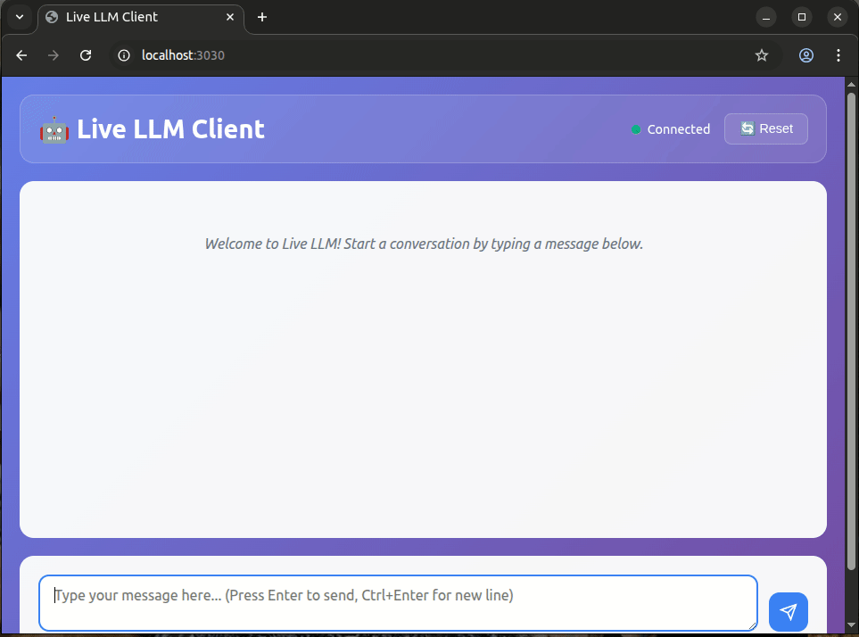

# Live LLM

An experimental LLM runtime that supports **live KV cache streaming** for conversational AI.  
Instead of re-sending the entire prompt and conversation history at every step, the client only sends **incremental state updates** that keep the model’s KV cache *hot*.  

This allows the LLM to respond faster and more interactively, at the expense of eventually forgetting the oldest parts of a conversation. Think of it as a **rolling window of conversational memory** that trades completeness for latency.

This is an actual demo of Gemma 270m running on CPU, with instantaneous, stateful responses since the KV cache is prepopulated with prompt and context.

---

## Use Cases

1. **Real-time Speech / TTS Agents**  
   - When paired with ASR + TTS, the hot cache enables fast, incremental responses  
   - Useful for low-latency voice assistants on edge devices
   - Can reset or swap KV cache to "forget" or switch to new conversational context

2. **Task oriented, assistant-type LLMs**  
   - Chatbots and assistants that need *snappy* replies within a given task without extensive context
   - Interactive storytelling or character responses

3. **Prototyping & Research**  
   - Great for experimenting with **streaming inference** and **incremental context**  

---

## Why Live KV Cache?

Traditional LLM runtimes rebuild the whole context on every request, which is expensive and slow.  
With a persistent **key-value cache**, each new message only needs to process the **delta** (the new tokens), which gives:

-  **Low Latency Responses** — No need to re-encode all prior messages  
-  **Lower Compute Cost** — Especially helpful on CPU-bound inference  
-  **Interactive Streaming** — Feels more like a real conversation than a batch job  
-  **Composable** — Clients can decide how much history to keep vs. reset  

---

## Advantages

-  **Speed**: Incremental generation is much faster on constrained hardware 
-  **Memory Efficiency**: Keeps just enough conversation history, instead of rebuilding context  
-  **Simple Integration**: WebSocket-based clients, easy to drop into other projects  
-  **Small-Model Friendly**: Runs with less then 1s to first-token with Gemma 3 270M on CPU (no GPU required)  
-  **Resettable**: Cache can be cleared mid-conversation for a fresh state  
-  **Context switchable**: Cache can be swapped mid-conversation for a new conversational goal

---

## Disadvantages / Trade-offs

-  **Single-Tenant**: Designed for *one conversation at a time* (multi-tenant orchestration would need a scheduler)  
-  **Forgets Old Context**: Since the cache is finite, earlier conversation turns are eventually dropped  
-  **Cache Invalidation Bugs**: Care must be taken to avoid mismatched inputs vs. cached states  
-  **Less Accurate Long-Form Reasoning**: Without full history, answers to very long threads may drift  

---

## Why This Repo Is Useful

- Demonstrates **how to wire up a live KV cache** in practice  
- Provides a **minimal, working FastAPI + WebSocket server** for streaming inference  
- Showcases running **Gemma 3 270M** in a **real-time loop** on CPU  
- Serves as a **reference architecture** for larger projects that want to experiment with:  
  - Edge inference (Jetson, Raspberry Pi, etc.)  
  - Realtime agents (voice, chat, embedded systems)  
  - LLM-backed multiplayer / multi-agent systems  

If you’ve ever wanted to see how **incremental LLM state** can be managed outside of “batch mode,” this project is a solid starting point.

---

## Features

- **Hot KV Cache** — Maintains conversation state for fast response times  
- **Live Streaming** — Real-time token streaming via WebSockets  
- **Modular Architecture** — Separate server, input client, and output client  
- **Gemma 3 270M Support** — Small, efficient model for CPU inference  
- **WebSocket API** — Clean separation between input and output  

---

## Environment Setup

### Dev Container (Recommended)

We use **VS Code Dev Containers** to ensure a consistent, isolated development environment.  

1. **Install prerequisites**
   - Install [Docker](https://docs.docker.com/get-docker/)
   - Install [Visual Studio Code](https://code.visualstudio.com/)
   - Install the [Dev Containers extension](https://marketplace.visualstudio.com/items?itemName=ms-vscode-remote.remote-containers)
 Installation guide: [VS Code Dev Containers Guide](https://code.visualstudio.com/docs/devcontainers/tutorial)

2. **Open in Dev Container**
   - Open this project folder in VS Code  
   - Press `F1` (or `Ctrl+Shift+P`) and run **Dev Containers: Reopen in Container**  
   - VS Code will detect the `.devcontainer/` config, build the container, and reopen inside it  

3. **Rebuild if Needed**
   - If you make changes to `.devcontainer/devcontainer.json` or Docker setup, press `F1` → **Dev Containers: Rebuild Container**

4. **Alternative entry**
   - From the sidebar, open **Remote Explorer**, right-click the container, and select **Rebuild and Reopen in Container**

